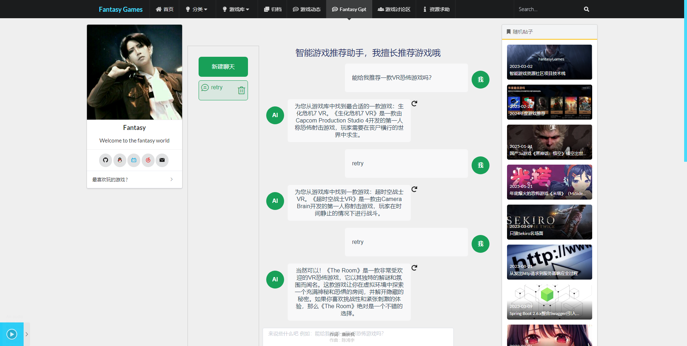
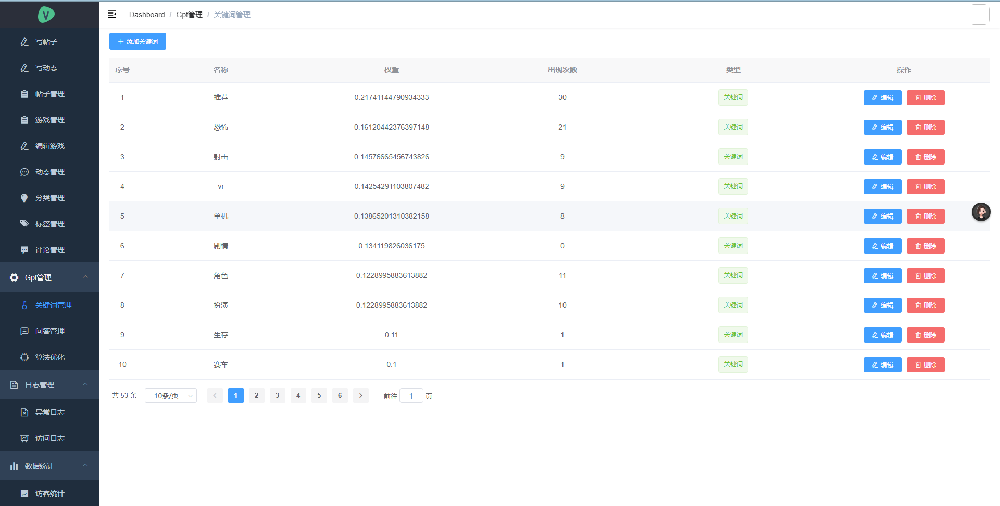

# Fantasy-Games

## 简介

基于springboot的智能游戏资源系统,自研发FantasyGpt智能游戏推荐助手，使用TF—IDF逆文档频率算法进行游戏检索与推荐，对检索算法进行优化

首页

游戏详情页

智能游戏推荐助手

后台管理

 [Fantasy0521/Fantasy-Games: 基于springboot的智能游戏资源系统 (github.com)](https://github.com/Fantasy0521/Fantasy-Games)

## 后端

1. 核心框架：[Spring Boot](https://github.com/spring-projects/spring-boot)
2. 持久层框架：[MybatisPlus](https://baomidou.com/pages/24112f/)
3. 分页插件：[PageHelper](https://github.com/pagehelper/Mybatis-PageHelper)
4. NoSQL缓存：[Redis](https://github.com/redis/redis)
5. Markdown 转 HTML：[commonmark-java](https://github.com/commonmark/commonmark-java)
6. 离线 IP 地址库：[ip2region](https://github.com/lionsoul2014/ip2region)
7. 定时任务：[quartz](https://github.com/quartz-scheduler/quartz)
8. UserAgent 解析：[yauaa](https://github.com/nielsbasjes/yauaa)
9. 后端API接口文档: [Swagger](https://swagger.io/)
10. 项目部署: [Linux](https://www.linux.org/pages/download/)

## 快速开始

1. 创建 MySQL 数据库`fantasy-games`，并执行`/Fantasy-Games/fantasy-games.sql`初始化表数据
2. 修改配置信息`Fantasy-Games/src/main/resources/application.yml`
3. 安装 Redis 并启动(暂不需要)
4. 启动后端服务
5. 分别在`blog-cms`和`blog-view`目录下执行`npm install`安装依赖
6. 分别在`blog-cms`和`blog-view`目录下执行`npm run serve`启动前后台页面
7. 如果需要在Linux环境下部署项目,需要修改配置文件active为linux,并且修改前端代码的请求地址为Linux下的ip

