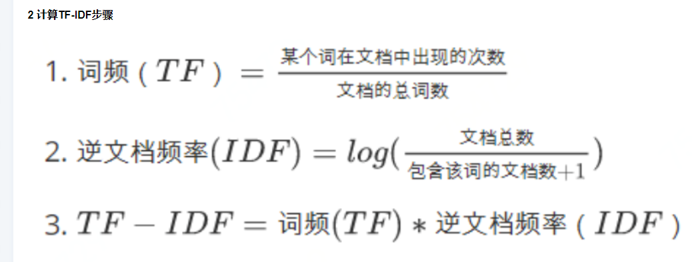
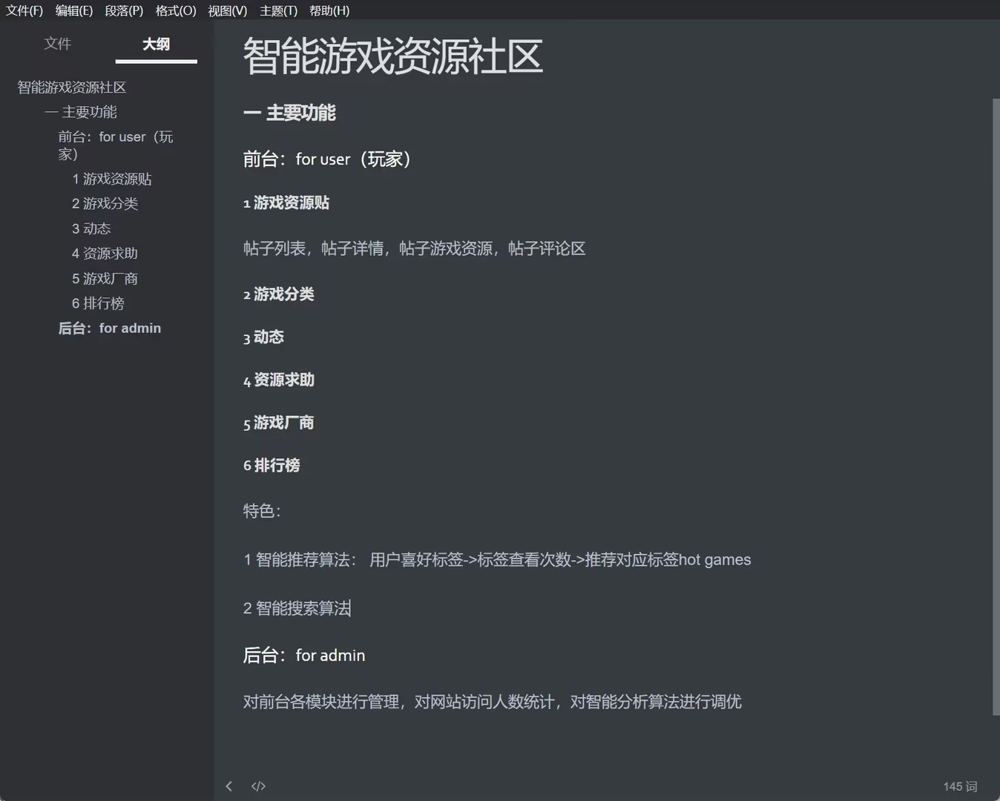

### 1 fantasy-chat

#### 构想

为用户提供游戏推荐服务，根据用户输入的关键词首先从数据库中寻找是否有高认可度回答记录，有则立即取出。没有就从游戏库中实时搜索对应数据，根据推荐算法计算检索到的游戏的推荐分，推荐分与关键词匹配度 使用 公式后得到最终分值，将最终分最高分游戏推荐给用户，保存问题和回答记录。

用户可以选择pick retry，pick可以增加该回答记录的认可度，retry则减认可度

如果没有与用户想匹配的回答

#### 涉及到的表：

1 game 游戏库

2 question 问题表

3 answer 回答表

4 keyword 关键词表

5 生成规则表(todo)

两张关联表 question_keyword和keyword_answer , answer中添加外键question_id

````
设计一个游戏推荐系统是一个很好的想法。根据你的描述，以下是详细的建议和设计思路，包括数据库表结构和推荐算法的设计。

### 数据库表结构

1. **game (游戏库)**
   - `id` (Long, 主键, 自增)
   - `name` (String, 游戏名称)
   - `developers` (String, 开发商)
   - `publisher` (String, 发行商)
   - `publish_date` (LocalDateTime, 发行日期)
   - `series` (String, 系列)
   - `official_url` (String, 官方地址)
   - `download_url` (String, 下载地址)
   - `first_picture` (String, 游戏首图)
   - `description` (String, 描述)
   - `is_published` (Boolean, 公开或私密)
   - `is_recommend` (Boolean, 推荐开关)
   - `is_appreciation` (Boolean, 赞赏开关)
   - `is_comment_enabled` (Boolean, 评论开关)
   - `views` (Integer, 浏览次数)
   - `stars` (Integer, 收藏次数)
   - `category_id` (Long, 游戏分类)
   - `is_top` (Boolean, 是否置顶)
   - `password` (String, 提取码)
   - `create_time` (LocalDateTime, 创建时间)
   - `update_time` (LocalDateTime, 更新时间)

2. **question (问题表)**
   - `id` (Long, 主键, 自增)
   - `user_id` (Long, 用户ID)
   - `content` (String, 问题内容)
   - `create_time` (LocalDateTime, 创建时间)

3. **answer (回答表)**
   - `id` (Long, 主键, 自增)
   - `question_id` (Long, 外键, 关联question表)
   - `game_id` (Long, 外键, 关联game表)
   - `relevance_score` (Double, 关键词匹配度)
   - `recommend_score` (Double, 推荐分)
   - `final_score` (Double, 最终分值)
   - `acceptance_count` (Integer, 认可度)
   - `create_time` (LocalDateTime, 创建时间)

4. **keyword (关键词表)**
   - `id` (Long, 主键, 自增)
   - `question_id` (Long, 外键, 关联question表)
   - `keyword` (String, 关键词)
   - `weight` (Double, 权重)

### 推荐算法设计

1. **关键词提取与匹配**
   - 用户输入关键词后，提取关键词并存储在 `keyword` 表中。
   - 计算每个关键词的权重，可以根据关键词在问题中的出现频率或TF-IDF算法来计算。

2. **从数据库中寻找高认可度回答记录**
   - 查询 `answer` 表中 `acceptance_count` 最高的记录。
   - 如果找到高认可度的回答记录，则直接返回该记录中的游戏。

3. **实时搜索对应数据**
   - 如果没有找到高认可度的回答记录，则从 `game` 表中搜索与关键词匹配的游戏。
   - 使用关键词匹配度和推荐分来计算最终分值。

4. **计算推荐分**
   - **关键词匹配度 (relevance_score)**: 计算关键词在游戏描述中的出现频率或使用TF-IDF算法。
   - **推荐分 (recommend_score)**: 根据游戏的浏览次数、收藏次数、是否推荐、是否置顶等因素计算。
   - **最终分值 (final_score)**: 使用以下公式计算：
     \[
     \text{final\_score} = \text{relevance\_score} \times \text{weight} + \text{recommend\_score}
     \]

5. **推荐游戏**
   - 根据最终分值排序，推荐最终分值最高的游戏。
   - 将问题和回答记录保存到 `question` 和 `answer` 表中。

6. **用户反馈**
   - 用户可以选择 `pick` 或 `retry`。
   - `pick` 增加 `acceptance_count`。
   - `retry` 减少 `acceptance_count`。

### 示例SQL语句

#### 插入问题和关键词
```sql
INSERT INTO `question` (`user_id`, `content`, `create_time`) 
VALUES (1, '推荐一款动作角色扮演游戏', '2024-01-01 00:00:00');

INSERT INTO `keyword` (`question_id`, `keyword`, `weight`) 
VALUES (1, '动作角色扮演游戏', 1.0);
```


#### 插入回答
```sql
INSERT INTO `answer` (`question_id`, `game_id`, `relevance_score`, `recommend_score`, `final_score`, `acceptance_count`, `create_time`) 
VALUES (1, 1, 0.9, 0.8, 1.7, 0, '2024-01-01 00:00:00');
```


#### 查询高认可度的回答
```sql
SELECT * FROM `answer` 
WHERE `question_id` = 1 
ORDER BY `acceptance_count` DESC 
LIMIT 1;
```


#### 计算最终分值
```sql
SELECT g.id, g.name, g.description, 
       k.relevance_score * k.weight + a.recommend_score AS final_score
FROM `game` g
JOIN `answer` a ON g.id = a.game_id
JOIN `keyword` k ON a.question_id = k.question_id
WHERE a.question_id = 1
ORDER BY final_score DESC
LIMIT 1;
```


### 总结

通过上述设计，你可以构建一个高效的游戏推荐系统。用户输入关键词后，系统会根据关键词匹配度和推荐分计算最终分值，并推荐最终分值最高的游戏。用户可以对推荐结果进行反馈，从而不断优化推荐算法。

````

#### 实现步骤

1 检查用户输入的问题是否已经在数据库中有相同的问题记录，有则直接根据question_id取出回答

2 没有相同的问题记录，这时候先从问题中提取关键词和对应的权重

3 在数据库中查找相同的关键词，通过关键词获取到所有的回答，通过关键词的权重和回答的认可度计算出最符合的一个回答

4 如果通过关键词也未找到已有回答，开始根据问题生成回答，从游戏库中找到符合用户关键词的游戏，通用语句+对应游戏 =》回答 。 回答和关键词存入数据库

5 如果在游戏库中未找到符合用户关键词的游戏，此时直接调用通义api生成回答，回答和关键词存入数据库

#### 问题

问题1 ：如何知道用户输入的问题中哪些词是关键字

````
确定用户输入问题中的关键字是一个关键步骤，可以通过自然语言处理（NLP）技术来实现。以下是一些常用的方法和工具，可以帮助你从用户输入的问题中提取关键字：

### 1. 使用TF-IDF（Term Frequency-Inverse Document Frequency）
TF-IDF是一种统计方法，用于评估一个词对于一个文档集或一个语料库中的某一个文档的重要程度。通过计算每个词的TF-IDF值，可以识别出文档中的重要关键字。

#### 示例代码（Python）
```python
from sklearn.feature_extraction.text import TfidfVectorizer

# 用户输入的问题
question = "推荐一款动作角色扮演游戏"

# 创建TF-IDF向量化器
vectorizer = TfidfVectorizer()

# 计算TF-IDF矩阵
tfidf_matrix = vectorizer.fit_transform([question])

# 获取特征名称（即关键词）
feature_names = vectorizer.get_feature_names_out()

# 获取TF-IDF值
tfidf_scores = tfidf_matrix.toarray()[0]

# 将关键词和对应的TF-IDF值组合成字典
keyword_scores = dict(zip(feature_names, tfidf_scores))

# 按TF-IDF值排序，获取前N个关键词
top_keywords = sorted(keyword_scores.items(), key=lambda x: x[1], reverse=True)[:5]

print(top_keywords)
```


### 2. 使用RAKE（Rapid Automatic Keyword Extraction）
RAKE是一种简单有效的关键字提取算法，适用于从短文本中提取关键字。

#### 示例代码（Python）
```python
from rake_nltk import Rake

# 用户输入的问题
question = "推荐一款动作角色扮演游戏"

# 创建RAKE对象
rake = Rake()

# 提取关键字
rake.extract_keywords_from_text(question)

# 获取关键字和对应的分数
keywords_with_scores = rake.get_ranked_phrases_with_scores()

# 获取前N个关键字
top_keywords = keywords_with_scores[:5]

print(top_keywords)
```


### 3. 使用NLTK（Natural Language Toolkit）
NLTK是一个强大的NLP库，可以用于分词、词性标注、命名实体识别等任务。

#### 示例代码（Python）
```python
import nltk
from nltk.corpus import stopwords
from nltk.tokenize import word_tokenize
from nltk.probability import FreqDist

# 下载必要的资源
nltk.download('punkt')
nltk.download('stopwords')

# 用户输入的问题
question = "推荐一款动作角色扮演游戏"

# 分词
tokens = word_tokenize(question)

# 去除停用词
stop_words = set(stopwords.words('english'))
filtered_tokens = [word for word in tokens if word.lower() not in stop_words]

# 计算词频
freq_dist = FreqDist(filtered_tokens)

# 获取前N个关键字
top_keywords = freq_dist.most_common(5)

print(top_keywords)
```


### 4. 使用预训练的语言模型（如BERT）
BERT（Bidirectional Encoder Representations from Transformers）是一种强大的预训练语言模型，可以用于各种NLP任务，包括关键字提取。

#### 示例代码（Python）
```python
from transformers import pipeline

# 创建关键字提取管道
keyword_extractor = pipeline('feature-extraction', model='distilbert-base-uncased')

# 用户输入的问题
question = "推荐一款动作角色扮演游戏"

# 提取特征
features = keyword_extractor(question)

# 这里可以使用一些后处理方法来提取关键字
# 例如，使用词频或TF-IDF来筛选关键字
```


### 5. 使用第三方API
还有一些第三方API可以用于关键字提取，例如：

- **Google Cloud Natural Language API**
- **IBM Watson Natural Language Understanding**
- **Microsoft Azure Text Analytics**

这些API通常提供更高级的功能和更好的准确性，但可能需要付费使用。

### 示例：使用RAKE提取关键字
以下是一个完整的示例，使用RAKE从用户输入的问题中提取关键字，并将其存储到数据库中。

#### 示例代码（Python）
```python
from rake_nltk import Rake
import sqlite3

# 用户输入的问题
question = "推荐一款动作角色扮演游戏"

# 创建RAKE对象
rake = Rake()

# 提取关键字
rake.extract_keywords_from_text(question)

# 获取关键字和对应的分数
keywords_with_scores = rake.get_ranked_phrases_with_scores()

# 获取前N个关键字
top_keywords = keywords_with_scores[:5]

# 连接到数据库
conn = sqlite3.connect('fantasy_games.db')
cursor = conn.cursor()

# 插入问题
cursor.execute("INSERT INTO question (user_id, content, create_time) VALUES (?, ?, ?)", (1, question, '2024-01-01 00:00:00'))
question_id = cursor.lastrowid

# 插入关键字
for score, keyword in top_keywords:
    cursor.execute("INSERT INTO keyword (question_id, keyword, weight) VALUES (?, ?, ?)", (question_id, keyword, score))

# 提交事务
conn.commit()

# 关闭连接
conn.close()
```


### 总结
通过上述方法，你可以从用户输入的问题中提取关键字，并将其存储到数据库中。这些关键字可以用于后续的推荐算法中，以提高推荐的准确性和相关性。选择合适的方法取决于你的具体需求和技术栈。
````

#### 1 获取关键词

##### 分词器

一个问题有多个词语组成，首先要将问题拆分成词语组

##### TF-IDF算法

通过计算词语在文档中出现的频率得出关键词，这里由于我们的文档就是用户输入的一个问题，文档总数就是数据库中所有的问题

[实战小项目：使用 TF-IDF 算法提取文章关键词-腾讯云开发者社区-腾讯云 (tencent.com)](https://cloud.tencent.com/developer/article/1614540)




### 2 通义api

[通义千问API参考_大模型服务平台百炼(Model Studio)-阿里云帮助中心 (aliyun.com)](https://help.aliyun.com/zh/model-studio/developer-reference/use-qwen-by-calling-api?utm_content=se_1020003562)

[首次调用通义千问API_大模型服务平台百炼(Model Studio)-阿里云帮助中心 (aliyun.com)](https://help.aliyun.com/zh/model-studio/getting-started/first-api-call-to-qwen?spm=a2c4g.11186623.help-menu-2400256.d_0_1_0.37a64823IJ6GBH#7d3305f0b3opp)

#### 相关配置

1 开通服务

```
        <!-- https://mvnrepository.com/artifact/com.alibaba/dashscope-sdk-java -->
        <!-- 通义api -->
        <dependency>
            <groupId>com.alibaba</groupId>
            <artifactId>dashscope-sdk-java</artifactId>
            <version>2.17.1</version>
        </dependency>
```

2 获取apiKey

```
sk-xxx
```

3 设置环境变量(也可以将key写在yml配置中)

```
setx DASHSCOPE_API_KEY "sk-xxx"
```

#### 封装调用方法

```java


import com.alibaba.dashscope.aigc.generation.Generation;
import com.alibaba.dashscope.aigc.generation.GenerationParam;
import com.alibaba.dashscope.aigc.generation.GenerationResult;
import com.alibaba.dashscope.common.Message;
import com.alibaba.dashscope.common.Role;
import com.alibaba.dashscope.exception.ApiException;
import com.alibaba.dashscope.exception.InputRequiredException;
import com.alibaba.dashscope.exception.NoApiKeyException;
import com.fantasy.model.bean.TongYiConf;
import org.springframework.beans.factory.annotation.Autowired;
import org.springframework.beans.factory.annotation.Value;
import org.springframework.stereotype.Component;

import java.util.Arrays;

/**
 * @author: fantasy
 * 通义语大模型调用工具
 */
@Component
public class TongYiUtil {

    @Autowired
    private TongYiConf tongYiConf;

    public String questAI(String question) {
        try {
            GenerationResult generationResult = callWithMessage(question);
            String result = generationResult.getOutput().getChoices().get(0).getMessage().getContent();
            return result;
        } catch (ApiException | NoApiKeyException | InputRequiredException e) {
            System.err.println("错误信息："+e.getMessage());
//            System.out.println("请参考文档：https://help.aliyun.com/zh/model-studio/developer-reference/error-code");
            throw new RuntimeException(e);
        }
    }


    public GenerationResult callWithMessage(String question) throws ApiException, NoApiKeyException, InputRequiredException {
        Generation gen = new Generation();
        Message systemMsg = Message.builder()
                .role(Role.SYSTEM.getValue())
                .content(tongYiConf.getRole())
                .build();
        Message userMsg = Message.builder()
                .role(Role.USER.getValue())
                .content(question)
                .build();
        GenerationParam param = GenerationParam.builder()
                // 若没有配置环境变量，请用百炼API Key将下行替换为：.apiKey("sk-xxx")
//                .apiKey(System.getenv("DASHSCOPE_API_KEY"))
                .apiKey(tongYiConf.getApiKey())
                // 模型列表：https://help.aliyun.com/zh/model-studio/getting-started/models
                .model(tongYiConf.getModel())
                .messages(Arrays.asList(systemMsg, userMsg))
                .resultFormat(GenerationParam.ResultFormat.MESSAGE)
                .build();
        return gen.call(param);
    }

}

```


```yaml
# 通义api配置
tongyi:
  # https://dashscope.console.aliyun.com/apiKey 前往这里获取apiKey进行替换
  apiKey: sk-
  # 模型名称 测试下来速度较快的: qwen-turbo  免费且较快的 qwen2.5-coder-3b-instruct
  model: qwen2.5-coder-3b-instruct
  # 角色 这里可以指定模型的角色 默认 You are a helpful assistant.
  role: You are a game recommendation assistant.
```

```java
package com.fantasy.model.bean;

import lombok.Data;
import org.springframework.boot.context.properties.ConfigurationProperties;
import org.springframework.stereotype.Component;

@Data
@Component
@ConfigurationProperties(prefix = "tongyi")
public class TongYiConf {

    private String apiKey;
    private String model;
    private String role;

}
```


### 3  前端设计

[从零到一：构建 Vue 2 聊天机器人应用的过程-逐字显示(完整代码)_vue-chatbot-CSDN博客](https://blog.csdn.net/mmc123125/article/details/143507778)

#### 关键代码

将matchQuestion方法替换为questAI，由于sendMessage为异步方法，因此需要将questAI也声明为异步方法并在方法内部使用await关键字同步等待请求结果

```js
let matchedQuestion = await this.questAI(userMessage);
```

```js
    // 发送请求
    async questAI(userMessage) {
      try {
        const res = await questAI(userMessage);
        if (res.code === 200) {
          this.answer = res.data;
          const result = {
            "question": userMessage,
            "answer": res.data.content
          };
          return result;
        } else {
          this.msgError(res.msg);
          return null; // 或者你可以返回一个错误对象
        }
      } catch (error) {
        this.msgError("请求失败");
        return null; // 或者你可以返回一个错误对象
      }
    },
```


机器回复逐字显示

```js
        const answer = matchedQuestion.answer;
        // 机器回复
        const machineResponseObj = { sender: 'machine', text: '' };
        currentChatNow.messages.push(machineResponseObj);

        const answerLetters = answer.split(''); // 将回复拆分成字母数组

        for (const letter of answerLetters) {
          machineResponseObj.text += letter;
          await this.delay(100); // 添加延迟以逐字显示
        }
```


base

```

```



```
随机排序，不分先后。欢迎交换友链~(￣▽￣)~*
以下是友链格式：
* 昵称：xxx
* 友链描述：在这里可以交换喜欢的游戏资源链接
* 网址：[http://localhost:8280/home](http://localhost:8280/home)
* 头像URL：[http://localhost:8080/img/avatar.jpg](http://localhost:8080/img/avatar.jpg)
* tips：还可以在下方评论区提出对本社区的建议哦


```

```
随机排序，不分先后。欢迎交换友链~(￣▽￣)~*

* 昵称：Fantasy
* 一句话：游龙当归海，海不迎我自来也。
* 网址：[https://github.com/Fantasy0521](https://github.com/Fantasy0521)
* 头像URL：[http://localhost:8080/img/avatar.jpg](http://localhost:8080/img/avatar.jpg)

仅凭个人喜好添加友链，请在收到我的回复邮件后再于贵站添加本站链接。原则上已添加的友链不会删除，如果你发现自己被移除了，恕不另行通知，只需和我一样做就好。


```

